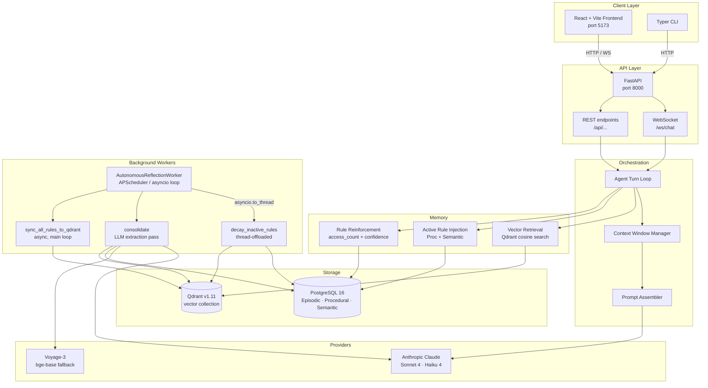

# Athena — Personal Adaptive AI Agent

> A self-hosted, memory-augmented AI agent that learns your coding preferences, project facts, and workflows over time and applies them automatically in every conversation.

[](https://www.python.org/)
[](https://fastapi.tiangolo.com/)
[](https://www.postgresql.org/)
[](https://qdrant.tech/)
[](./LICENSE)

---

## Table of Contents

1. [Overview](#overview)
2. [Architecture](#architecture)
3. [Quickstart](#quickstart)
4. [Configuration Reference](#configuration-reference)
5. [API Reference](#api-reference)
6. [Memory System](#memory-system)
7. [Autonomous Worker](#autonomous-worker)
8. [CLI](#cli)
9. [Production Hardening (v1.0.0)](#production-hardening-v100)
10. [Development](#development)
11. [Contributing](#contributing)

---

## Overview

Athena is a **fully self-hosted** personal AI assistant built on a custom lightweight agent loop — no LangChain, no AutoGen, no black-box orchestrators. Every layer of memory injection and prompt construction is transparent and inspectable.

**Key capabilities:**

| Capability | Description |
|---|---|
| **Episodic memory** | Stores conversation turns with importance scoring |
| **Procedural memory** | Learns user rules/preferences; detects conflicts & supersessions |
| **Semantic memory** | Retains project facts and domain knowledge |
| **Nightly consolidation** | LLM-driven extraction of durable knowledge from episodic turns |
| **Vector retrieval** | Cosine similarity search over Qdrant for context injection |
| **Confidence decay** | Active rules decay when unused; archived when below threshold |
| **Tool safety** | All destructive tool calls require explicit user confirmation |

---

## Architecture



### Thread-offloading policy

| Operation | Strategy | Reason |
|---|---|---|
| `_fetch_active_rules` (DB read) | `run_db` → `asyncio.to_thread` | Pure sync SQLModel query; safe to thread |
| `search_memory_vectors` (Qdrant) | `run_db` → `asyncio.to_thread` | Blocking gRPC/HTTP; no async needed inside |
| `reinforce_rule_access` (DB write) | `run_db` → `asyncio.to_thread` | Opens own session; self-contained sync |
| `_check_pending_count` (DB read) | `run_db` → `asyncio.to_thread` | Pure sync count query |
| `_run_decay_pass` (DB write + Qdrant) | `run_db` → `asyncio.to_thread` | Fully sync; isolated session |
| `consolidate()` | **Direct await** | Holds `asyncio.Lock` across interleaved LLM awaits — cannot be threaded |
| `sync_all_rules_to_qdrant()` | **Direct await** | Is itself `async`; may `await embed_text()` internally |

---

## Quickstart

### Prerequisites

- Docker ≥ 24 + Docker Compose v2
- Anthropic API key
- Voyage AI API key (or set `EMBEDDING_MODE=local` for the bge-base-en-v1.5 fallback)

### 1. Clone and configure

```bash
git clone https://github.com/your-org/athena-agent.git
cd athena-agent
cp .env.example .env
```

Edit `.env` and set at minimum:

```env
ANTHROPIC_API_KEY=sk-ant-...
VOYAGE_API_KEY=pa-...
APP_ACCESS_TOKEN=<generate a long random string>
```

### 2. Start all services

```bash
docker compose up -d
```

This starts:
- **PostgreSQL 16** on port `5432`
- **Qdrant v1.11** on ports `6333` (HTTP) / `6334` (gRPC)
- **Backend** (FastAPI) on port `8000`
- **Frontend** (React/Vite) on port `5173`

### 3. Run database migrations

```bash
docker compose exec backend alembic upgrade head
```

### 4. Open the web UI

Navigate to **http://localhost:5173** and enter your `APP_ACCESS_TOKEN` when prompted.

### 5. (Optional) Use the CLI

```bash
cd cli
pip install -e .
athena chat "What do you remember about my coding style?"
```

---

## Configuration Reference

All settings are loaded from environment variables (via `.env`). See [`.env.example`](./.env.example) for the full list.

| Variable | Default | Description |
|---|---|---|
| `ANTHROPIC_API_KEY` | — | **Required.** Anthropic API key |
| `LLM_MODEL_PRIMARY` | `claude-sonnet-4-6` | Primary model for chat turns |
| `LLM_MODEL_LIGHT` | `claude-haiku-4-5-20251001` | Lightweight model for consolidation |
| `EMBEDDING_MODE` | `hosted` | `hosted` (Voyage-3) or `local` (bge-base-en-v1.5) |
| `VOYAGE_API_KEY` | — | Required when `EMBEDDING_MODE=hosted` |
| `DATABASE_URL` | `postgresql://...` | SQLAlchemy connection string |
| `QDRANT_URL` | `http://qdrant:6333` | Qdrant HTTP endpoint |
| `APP_ACCESS_TOKEN` | — | **Required.** Bearer token for all API calls |
| `CONFIRM_DESTRUCTIVE_ACTIONS` | `true` | Gate all destructive tool calls behind user approval |
| `SANDBOX_MODE` | `subprocess` | Tool execution sandbox (`subprocess` or `docker`) |
| `REFLECTION_INTERVAL_SECONDS` | `60` | Worker loop cadence in seconds |
| `LOG_LEVEL` | `info` | Structured log level (`debug` / `info` / `warning` / `error`) |
| `ENVIRONMENT` | `development` | `development` or `production` |

---

## API Reference

All endpoints require the `Authorization: Bearer <APP_ACCESS_TOKEN>` header.

Interactive OpenAPI docs: **http://localhost:8000/docs**

### Chat

| Method | Path | Description |
|---|---|---|
| `WS` | `/ws/chat` | Streaming chat WebSocket |
| `POST` | `/api/chat/message` | Single-turn chat (non-streaming) |
| `GET` | `/api/sessions` | List all conversation sessions |
| `GET` | `/api/sessions/{id}` | Get session with full turn history |
| `DELETE` | `/api/sessions/{id}` | Delete session and episodic turns |

### Memory

| Method | Path | Description |
|---|---|---|
| `GET` | `/api/memory/rules` | List active procedural rules |
| `POST` | `/api/memory/rules` | Create procedural rule manually |
| `PATCH` | `/api/memory/rules/{id}` | Update rule statement or confidence |
| `DELETE` | `/api/memory/rules/{id}` | Deactivate a rule (soft delete) |
| `GET` | `/api/memory/facts` | List active semantic facts |
| `GET` | `/api/memory/episodic` | List episodic turns (paginated) |
| `POST` | `/api/memory/reflect` | Trigger consolidation pass manually |

### Tools

| Method | Path | Description |
|---|---|---|
| `GET` | `/api/tools` | List registered tools with risk scores |
| `POST` | `/api/tools/approve/{id}` | Approve a pending tool action |
| `POST` | `/api/tools/reject/{id}` | Reject a pending tool action |

### Health

| Method | Path | Description |
|---|---|---|
| `GET` | `/api/health` | Liveness check (returns `{"status": "ok"}`) |
| `GET` | `/api/health/ready` | Readiness — checks DB + Qdrant connectivity |

---

## Memory System

Athena has three memory tiers, each stored in PostgreSQL with vector representations in Qdrant:

### Episodic Memory (`MemoryEpisodic`)

Raw conversation turns scored for importance (0 – 1). Turns above the `importance_threshold` are candidates for consolidation into procedural/semantic memories.

### Procedural Memory (`MemoryProcedural`)

Durable user rules and preferences (e.g. *"always use strict type hints"*). Each rule has:
- `confidence` — decays over time when not accessed; boosted on retrieval
- `version` — incremented when a newer rule supersedes an older one
- `is_active` — false when archived or superseded
- Conflict detection via opposing-cluster heuristics + LLM-flagged supersessions

### Semantic Memory (`MemorySemantic`)

Project facts and domain knowledge (e.g. *"the project uses PostgreSQL 16"*). Versioned and deduplicated the same way as procedural rules.

### Retrieval pipeline (per chat turn)

```
1. Embed query text  → Voyage-3 / bge-base
2. _fetch_active_rules()  → thread-offloaded DB read
3. search_memory_vectors()  → thread-offloaded Qdrant cosine search (active_only=True)
4. reinforce_rule_access()  → thread-offloaded DB write + Qdrant payload sync
5. Inject top-k results into system prompt
```

All three DB/network operations are dispatched via `run_db` (`asyncio.to_thread`) so the event loop is never stalled during memory retrieval.

---

## Autonomous Worker

`AutonomousReflectionWorker` runs in the background as an asyncio task and fires every `REFLECTION_INTERVAL_SECONDS` seconds.

**Loop steps (per tick):**

| Step | Method | Thread-offloaded? |
|---|---|---|
| Count pending turns | `_check_pending_count` | ✅ `run_db` |
| LLM consolidation | `ReflectionService.consolidate()` | ❌ holds `asyncio.Lock` + awaits LLM |
| Confidence decay | `_run_decay_pass` | ✅ `run_db` |
| Qdrant reconciliation | `ReflectionService.sync_all_rules_to_qdrant()` | ❌ `async`; may await `embed_text` |

The worker is started at app startup via FastAPI's `lifespan` context and gracefully cancelled on shutdown.

---

## CLI

```
Usage: athena [OPTIONS] COMMAND [ARGS]...

Options:
  --url TEXT   Backend URL  [default: http://localhost:8000]
  --token TEXT Bearer token (or set APP_ACCESS_TOKEN env var)

Commands:
  chat     Start an interactive chat session
  memory   Inspect and manage memory tiers
  reflect  Trigger a manual consolidation pass
  rules    List / create / edit procedural rules
  health   Check backend connectivity
```

---

## Production Hardening (v1.0.0)

### Thread-offloading (`run_db`)

All blocking synchronous SQLModel queries and Qdrant client calls that live inside `async` coroutines are dispatched to a thread pool via `run_db`:

```python
# app/db/session.py
async def run_db(func: Callable[..., T], *args, **kwargs) -> T:
    """Offload blocking sync SQLModel / DB operations to a thread pool executor."""
    return await asyncio.to_thread(func, *args, **kwargs)
```

Callers in `chat.py`:

```python
# DB read — no longer blocks the event loop
active_rules = await run_db(_fetch_active_rules)

# Qdrant cosine search
retrieved_memories = await run_db(
    search_memory_vectors,
    query_vector=query_vector,
    limit=limit,
    collection_name=DEFAULT_COLLECTION_NAME,
    active_only=True,
)

# DB write + Qdrant payload sync
reinforced = await run_db(reinforce_rule_access, rule_ids=target_rule_ids)
```

Callers in `worker.py`:

```python
# Count pending turns
pending_count = await run_db(_check_pending_count, self.importance_threshold)

# Decay pass
decay_res = await run_db(_run_decay_pass, self.reflection_service)
```

### Why `consolidate()` and `sync_all_rules_to_qdrant()` are NOT thread-offloaded

**`consolidate()`** acquires an `asyncio.Lock` (`_consolidation_lock`) and interleaves multiple `await` calls to the LLM provider (embeddings + generation) across its execution. Pushing it into `asyncio.to_thread` would mean those `await` expressions run in a worker thread without a running event loop, which is unsupported in Python's asyncio model. The lock would also need to be re-entrant across threads — a fundamentally different synchronisation primitive.

**`sync_all_rules_to_qdrant()`** is declared `async` and may internally call `await self.embedding_provider.embed_text(...)` for rules that are missing from Qdrant. An `async` function cannot be passed directly to `asyncio.to_thread`; it must be scheduled on the running event loop via `await` or `asyncio.ensure_future`.

### PostgreSQL advisory locks

For multi-process deployments (e.g. multiple Gunicorn/Uvicorn workers), `consolidate()` additionally acquires a PostgreSQL advisory lock (`pg_try_advisory_lock`) keyed on `POSTGRES_CONSOLIDATION_LOCK_ID = 982347102`. If another worker process holds the lock the call returns immediately with `status: "in_progress"`.

### Security

- All API routes require `Authorization: Bearer <APP_ACCESS_TOKEN>`.
- `CONFIRM_DESTRUCTIVE_ACTIONS=true` gates any mutating tool call (file writes, shell commands, `git push`) behind the Approval Queue before execution.
- Secrets live exclusively in `.env`; they are never injected into vector payloads or logged at any level.

### Database pool

```python
engine_kwargs = {
    "pool_pre_ping": True,       # detect stale connections
    "pool_recycle": 1800,        # recycle connections every 30 min
    "pool_size": 10,             # (PostgreSQL only)
    "max_overflow": 20,          # (PostgreSQL only)
}
```

SQLite (single-machine mode) uses `check_same_thread=False` and registers a custom `least()` function so `func.least()` works identically to PostgreSQL.

---

## Development

### Local setup (no Docker)

```bash
# Backend
cd backend
python -m venv .venv && source .venv/bin/activate   # or .venv\Scripts\activate on Windows
pip install -r requirements.txt
cp ../.env.example ../.env   # edit as needed
DATABASE_URL=sqlite:///./data/agent.db alembic upgrade head
uvicorn app.main:app --reload --port 8000

# Frontend
cd ../frontend
npm install
npm run dev
```

### Running tests

```bash
cd backend
pytest -v --tb=short
```

### Alembic migrations

```bash
# Generate a new migration
alembic revision --autogenerate -m "describe_change"

# Apply
alembic upgrade head

# Rollback one step
alembic downgrade -1
```

### Structured logs

Athena uses [structlog](https://www.structlog.org/) for all server-side logging. In development, logs are rendered as coloured key-value pairs. In production (`ENVIRONMENT=production`), they are emitted as JSON for ingestion into Loki / CloudWatch / etc.

---

## Contributing

1. Fork the repository and create a feature branch.
2. Follow the **fixed technology stack** defined in [`AGENTS.md`](./AGENTS.md) — do not introduce LangChain, CrewAI, AutoGen, or alternative ORMs without prior discussion.
3. Add or update tests for any changed logic.
4. Open a PR against `main` with a clear description of the change and any relevant architecture decisions.

See [`docs/PLAN.md`](./docs/PLAN.md) for the phased build plan. Never implement features from a future phase until the current phase's *Definition of Done* is met.

---

*Built with ❤️ using FastAPI · SQLModel · Qdrant · Anthropic Claude · React*
